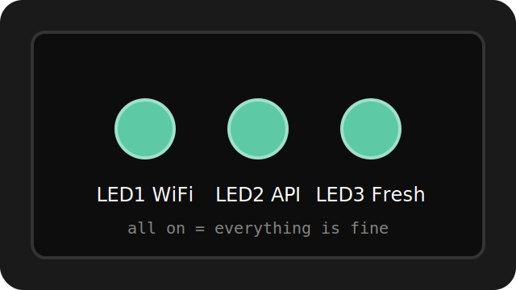

# Narodmon watchdog — Wemos D1 Mini relay reboot

A small ESP8266 (Wemos D1 Mini) watchdog that monitors one or two sensors on [narodmon.ru](https://narodmon.ru) and power-cycles a target device through a relay if the sensor data goes stale — useful for unattended IoT sensor nodes that occasionally freeze or lose WiFi and need a hard reboot to recover.

Author: **xumbax**

## Why

Some ESP-based sensor nodes occasionally lock up (WiFi stack glitches, memory leaks after days of uptime) and stop reporting. Rather than physically walking over to power-cycle the device, this watchdog checks the device's own published sensor data on narodmon — if it hasn't updated in a while, that's a reliable proxy for "the node is stuck," and the watchdog cuts and restores power via a relay.

## How it works

- Every 5 minutes, the watchdog queries narodmon for the target device's sensor(s) via `sensorsValues`
- **"OR" logic with two sensors**: if you give it two sensor IDs (e.g. temperature and pressure from the same device), it only reboots if *both* are stale at the same time — a single disconnected probe won't trigger an unnecessary reset
- If the freshest of the two readings is older than `STALE_MINUTES` (default 30), the relay opens for 8 seconds, then closes — power-cycling the target device
- **Anti-cycling lockout**: after 3 resets in a row, the watchdog backs off for 1 hour instead of endlessly rebooting a device that won't come back
- Time comparisons use pure UTC (matching narodmon's `time` field exactly) — a separate display-only function adds your timezone offset just for readable log output, so the actual reboot logic is never affected by timezone math

## LED indicators

| LED | Pin | Meaning when on |
|---|---|---|
| LED1 | D5 (GPIO14) | WiFi connected (blinks while connecting) |
| LED2 | D6 (GPIO12) | narodmon responded and at least one sensor was found |
| LED3 | D7 (GPIO13) | Data is fresher than `FRESH_MINUTES` (everything is fine) |

All three LEDs blink together 3 times whenever a relay reset happens.

## Hardware

- Wemos D1 Mini (ESP8266)
- 1-channel relay module (NC — normally closed contact used)
- 3 LEDs + 220-330 Ω resistors

### Wiring

**Relay (NC contact, normally closed):**
- D1 Mini D1 (GPIO5) → relay module IN
- D1 Mini 3V3 → relay module VCC
- D1 Mini GND → relay module GND
- Relay COM → +5V from the power adapter
- Relay NC → +5V (red wire) of the target device's power cable
- Adapter GND → target device GND directly, bypassing the relay

**LEDs (each through a 220-330 Ω resistor to GND):**
- LED1 (WiFi): D5 (GPIO14) → anode → resistor → GND
- LED2 (API): D6 (GPIO12) → anode → resistor → GND
- LED3 (Fresh): D7 (GPIO13) → anode → resistor → GND

## Setup

1. Arduino IDE, add the ESP8266 board package: `http://arduino.esp8266.com/stable/package_esp8266com_index.json`
2. Libraries: `ArduinoJson` v6 (Benoit Blanchon), `NTPClient` (Fabrice Weinberg) — `ESP8266WiFi`/`ESP8266HTTPClient`/`MD5Builder` ship with the board package
3. Open `narodmon_watchdog.ino` and fill in:
   - `WIFI_SSID`, `WIFI_PASS`
   - `NM_API_KEY` — narodmon.ru → Profile → My applications
   - `NM_SENSOR_ID`, `NM_SENSOR_ID2` — the numeric IDs of the sensors you want to watch (the number after `S` on the sensor's page, e.g. `S12345` → `12345`); both must be public
   - `TZ_OFFSET_SEC` — your UTC offset in seconds, used only for readable log timestamps
4. Flash, then open Serial Monitor at 115200 baud — it prints the full request/response for each check, which is handy for confirming the sensor IDs are correct

## Notes on the narodmon API

- Requests are sent once per `CHECK_INTERVAL` (default 5 minutes), well within the 1 request/minute limit
- Time comparisons rely on `time` from narodmon's API response being UTC unix time — the NTP client here is deliberately configured with `offset=0` to match it exactly

## License

MIT — use, modify, and distribute freely.

## Acknowledgments

Data provided by the [narodmon.ru](https://narodmon.ru) project — a crowdsourced network of weather and environmental sensors.
